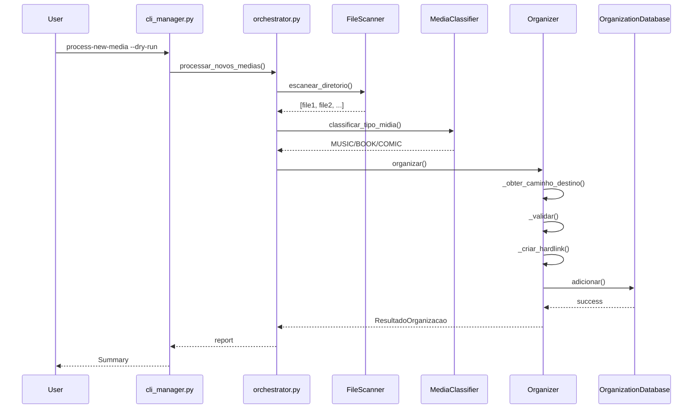
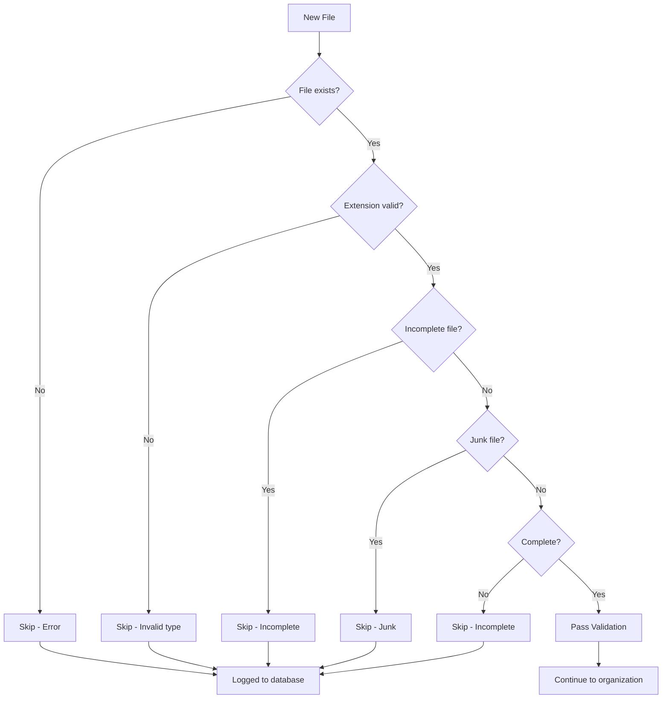
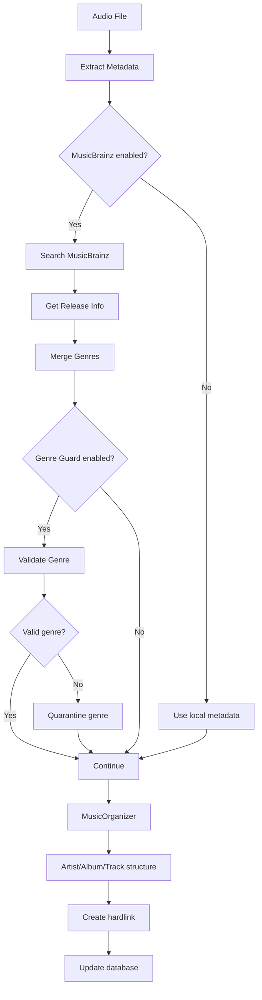
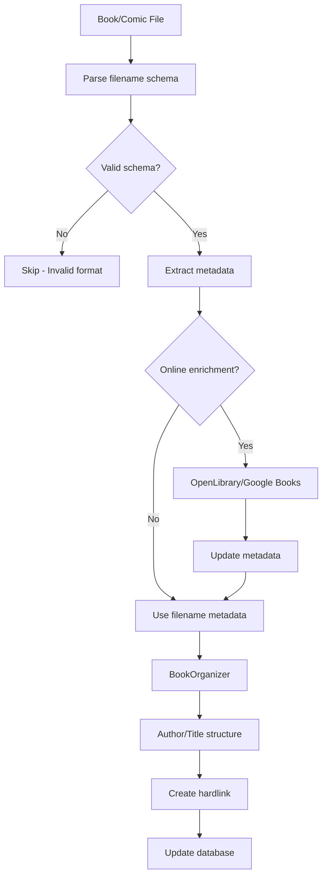
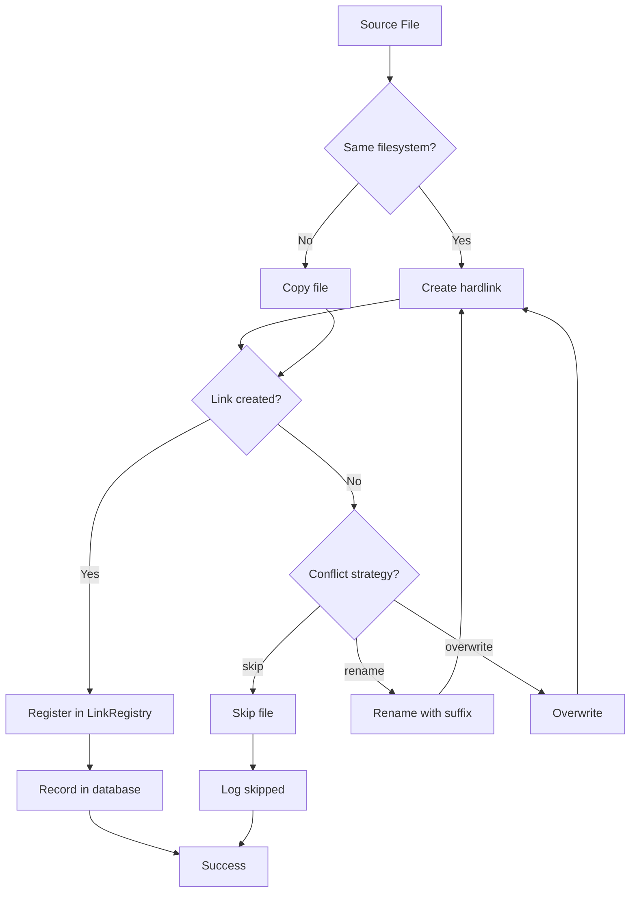
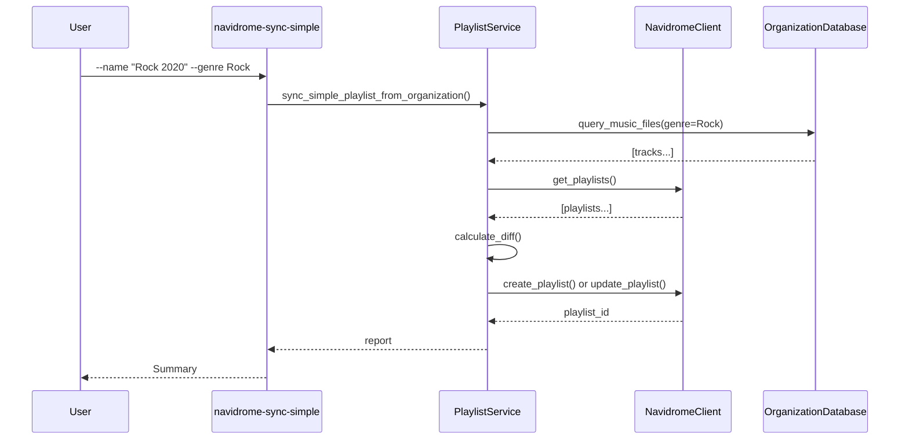
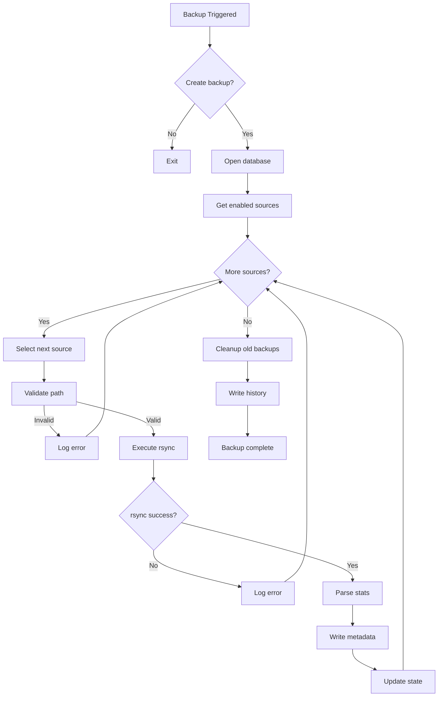
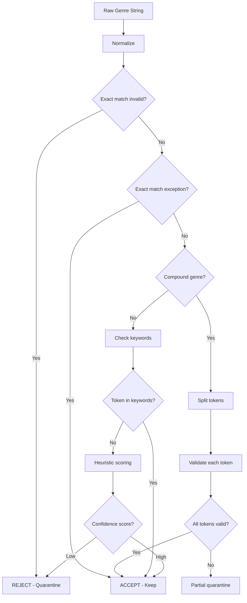

# Data Flow

## Media Organization Flow

## Validation Pipeline

## Music Organization Detail

## Book/Comic Organization Detail

## Hardlink Creation Flow

## Navidrome Playlist Sync

## Backup Creation Flow

## Genre Guard Validation

