# Data Flow

## Main Processing Pipeline

```mermaid
flowchart LR
    subgraph Scan
        S1[Scan Directory]
        S2[Filter Already Organized]
        S3[File Completion Check]
    end

    subgraph Classify
        C1[Detect Media Type]
        C2[Route to Organizer]
    end

    subgraph Validate
        V1[File Existence]
        V2[File Type]
        V3[Incomplete Files]
        V4[Junk Files]
    end

    subgraph Enrich
        E1[Extract Metadata]
        E2[Online Enrichment]
        E3[Genre Validation]
    end

    subgraph Organize
        O1[Conflict Resolution]
        O2[Create Hardlink]
        O3[Record in DB]
    end

    Scan --> Classify --> Validate --> Enrich --> Organize
```



## Media Organization Flow

### Music Organization

```
Download → Scan → Classify(MUSIC) → Validate → Enrich(MusicBrainz/Last.fm)
       → MusicOrganizer → Hardlink(Artist/Album/Track.ext) → DB
```

### Book Organization

```
Download → Scan → Classify(BOOK) → Validate → Enrich(OpenLibrary/Google Books)
       → BookOrganizer → Hardlink(Author/Title.ext) → DB
```

### Comic Organization

```
Download → Scan → Classify(COMIC) → Validate → Parse Filename Schema
       → ComicOrganizer → Hardlink(Title (Year) - Series #Issue.ext) → DB
```

## Validation Pipeline

All files pass through 4 global validators + 1 completion validator:

1. **FileExistenceValidator** - File exists and is accessible
2. **FileTypeValidator** - Extension in supported set
3. **IncompleteFileValidator** - Rejects `.part`, `.tmp`, `.!qB`, `.crdownload`, `.aria2`
4. **JunkFileValidator** - Rejects promotional/sponsor patterns
5. **FileCompletionValidator** - Monitors size stability over time
